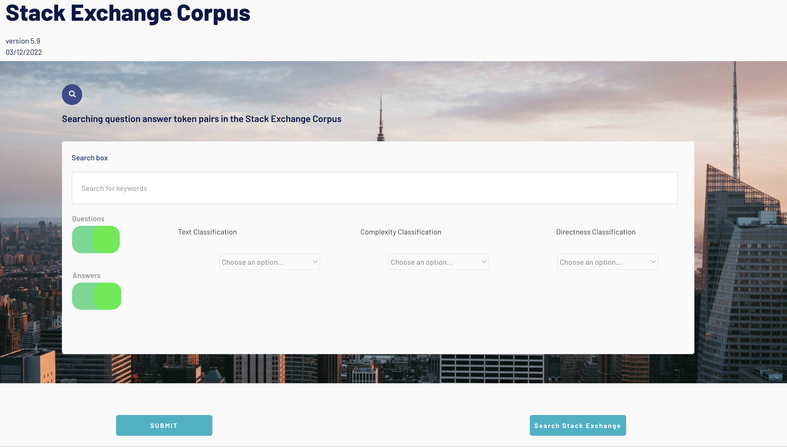

# Interface Design

| Team member | Student number  |
| :--: | :--: |
| Mohammad Ahsan Ghani | 82873100 |
|   Jeremy Yang    |  57353781   |
|  Oksana Necio    |  75493593  |
|   Ruoyao Yin   | 59004859  |

## Frontend Layout:
* The frontend of the web application is meant to interact with the backend written in Python in a meaningful way such that it can extract and display search results from our previously mentioned Stack Exchange corpus.
* We intend to have a banner at the very top displaying our Corpus and the latest date of information extraction, to let users know how recent the data is noted by a version number and date time stamp of most recent modifications.
* The header will be followed by a short sample of a question answer pair with arrows pointing to the text to highlight certain features which were detected and annotated for text classification, complexity and directness accordingly.
* The previously mentioned sample will serve as a reference point for a brief documentation to lay out the expectations of what can be extracted from this corpus and the syntax and metadata associated respectively with the tokens.
* The documentation will be followed by a text entry bar for searching by text.
* The search entry bar will be followed by 3 drop down lists, one for each of the annotations.
* To the right side of the text entry and drop down menus, we will add 2 toggle switches for each of the following:
  * include metadata
  * include raw output
  * include more answers to the same question
* All of the previously mentioned will be followed by a submit button which will trigger the query on the backend as demonstrated on the mock-up diagram attached herewith for your reference.

## Text Search Functionality:
* The text search functionality will return one or many question answer pair(s) pertaining to one or many of the following input categories as highlighted by the following text input strings:
  * string exists in question
    * input via text entry bar
    * toggle switch to search via question
  * string exists in answer
    * input via text entry bar
    * toggle switch to search via answer
* Furthermore, we would high encourage users to optimize searches by the following:
  * shorter strings for maximize results
  * separate keyword strings by commas
  * narrow keywords by topic of discussion for more accurate results

## Annotation Search Functionality:
* The annotation search functionality will return one or many question answer pair(s) pertaining to one or many of the following classification categories as highlighted by the following drop down menu options:
  * string as classification evaluation
    * drop down menu
    * multi-select options
  * string as complexity evaluation
    * drop down menu
    * multi-select options
  * string as directness evaluation
    * drop down menu
    * multi-select options
* Furthermore, we would high encourage users to search by the following:
  * default "all" option on all three drop down menus to maximize results
  * attempt a variety of drop down menu combinations to maximize results

## Graphical Visualizations:
* For a query that returns multiple question answer pairs, we would like to return a modal dialogue which expresses graphical visualizations such as the following:
  * a pie chart for the distribution of text classification categories
  * a pie chart for the distribution of complexity classification categories
  * a pie chart for the distribution of directness classification categories
* Inter annotator agreement is very important to highlight the robustness of the corpus as well as our data collection and annotation accuracy.
* We would like to take this into consideration and express the previously mentioned agreement (or lack thereof) graphically in each of the pie charts by implementing the following:
  * data on this pie chart would be reinforced by inter-annotator agreement
  * we would visually demonstrate the discrepancy between annotators and show both results
  * where the inter-annotator agreement is lacking, we would represent this visually by superimposing the results using colour and opacity

## Direct Stack Exchange Search:
* Finally, we can anticipate that a very curious individual might be interested in even more results pertaining to similar subject matter which may or may not exceed the capacity of our corpus, at the time that it was generated or the data was acquired.
* To facilitate this curiousity, we would like to add a button towards the bottom of the page whereby one can duplicate their query string but trigger search results from the host server directly thereby re-routing them to Stack Exchange itself for further investigation.
* This is an optional feature and still under review by the teammates as well as project mentor(s).

## UX Mockup / Wireframe Diagram:
* Please refer to the following link for a live demonstration of the landing page:
  * [landing page ux/ui mockup](https://523.bubbleapps.io/version-test?debug_mode=true)
* Please refer to the following screen capture of the live demonstration if the landing page fails to load:

